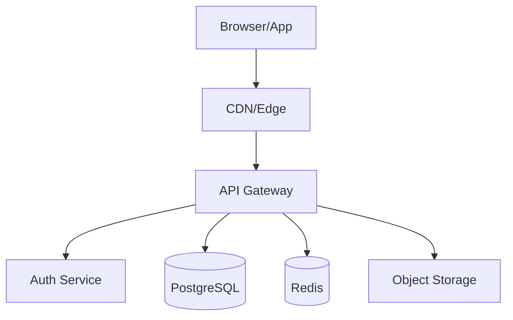
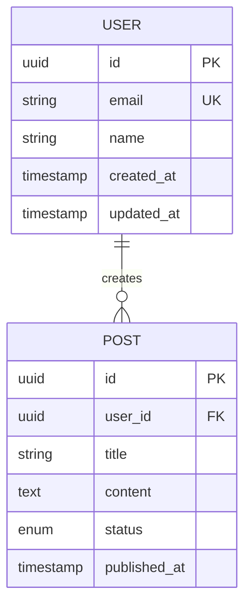
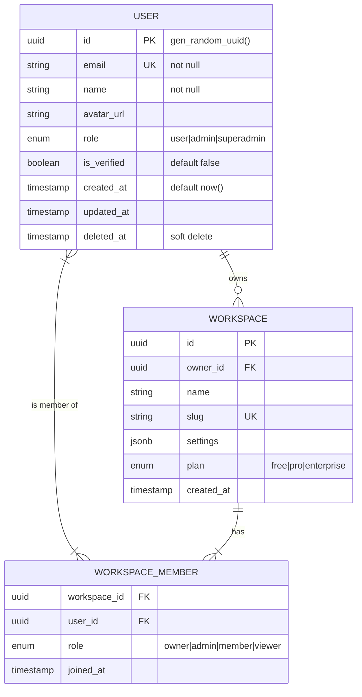

# REY — Documentation Standards

> Dokumentasi yang bagus adalah yang dibaca, bukan yang disimpan.

---

## 📄 PRD — PRODUCT REQUIREMENTS DOCUMENT

```markdown
# PRD: [Product Name]

**Version**: 1.0  
**Status**: Draft / In Review / Approved  
**Author**: [Name]  
**Last Updated**: [Date]  
**Stakeholders**: [List]

---

## 1. Executive Summary
[2-3 kalimat: apa yang dibangun, untuk siapa, dan kenapa sekarang]

## 2. Problem Statement
**Masalah**: [Deskripsi masalah konkret]  
**Dampak**: [Siapa yang terdampak dan seberapa besar]  
**Root cause**: [Mengapa masalah ini exist]

## 3. Goals & Success Metrics
| Goal | Metric | Target | Timeline |
|------|--------|--------|----------|
| [Goal] | [KPI] | [Value] | [Date] |

## 4. User Personas
### Primary: [Persona Name]
- **Who**: [Deskripsi]
- **Pain points**: [List]
- **Goals**: [List]
- **Tech literacy**: [Low/Medium/High]

## 5. User Stories
**Must Have (P0)**:
- As a [user], I want to [action] so that [benefit]

**Should Have (P1)**:
- As a [user], I want to [action] so that [benefit]

**Nice to Have (P2)**:
- As a [user], I want to [action] so that [benefit]

## 6. Out of Scope
- [Explicitly list apa yang TIDAK dibangun di scope ini]

## 7. Constraints & Assumptions
- **Tech constraints**: [List]
- **Business constraints**: [Timeline, budget]
- **Assumptions**: [Yang dianggap benar tapi belum diverifikasi]

## 8. Open Questions
| Question | Owner | Due Date | Status |
|----------|-------|----------|--------|
| [?] | [Name] | [Date] | Open |
```

---

## 🏗️ TDD — TECHNICAL DESIGN DOCUMENT

```markdown
# TDD: [Feature/System Name]

**Version**: 1.0  
**Status**: Draft  
**Author**: [Name]  
**Reviewers**: [Names]  
**Related PRD**: [Link]

---

## 1. Overview
[Ringkasan teknis 1 paragraf]

## 2. Architecture Overview
[Mermaid diagram sistem]



## 3. Tech Stack Decision
| Layer | Technology | Reasoning |
|-------|-----------|-----------|
| Frontend | | |
| Backend | | |
| Database | | |
| Cache | | |
| Auth | | |
| Deployment | | |

## 4. Data Models



## 5. API Specification

### Base URL: `https://api.example.com/v1`

#### POST /auth/login
```
Request:
{
  "email": "string",
  "password": "string"
}

Response 200:
{
  "token": "string",
  "user": { "id": "uuid", "email": "string", "name": "string" }
}

Response 401:
{ "error": "Invalid credentials" }
```

## 6. Security Considerations
- Authentication: [Method]
- Authorization: [RBAC/ABAC approach]
- Data encryption: [At rest / in transit]
- Input validation: [Approach]
- Rate limiting: [Limits]
- OWASP Top 10 mitigations: [List]

## 7. Performance Targets
| Metric | Target | Measurement |
|--------|--------|-------------|
| API response time | < 200ms (p95) | Sentry |
| Page load (LCP) | < 2.5s | Lighthouse |
| Database query | < 50ms (p99) | DB monitoring |

## 8. Error Handling Strategy
[How errors propagate, logging, user-facing messages]

## 9. Testing Strategy
- Unit tests: [Coverage target, tools]
- Integration tests: [Scope, tools]
- E2E tests: [Critical paths, tools]

## 10. Deployment Plan
- Environments: dev → staging → production
- Feature flags: [Which features behind flags]
- Rollback plan: [Procedure]
- Monitoring: [Alert thresholds]

## 11. Implementation Phases
| Phase | Scope | Duration | Dependencies |
|-------|-------|----------|--------------|
| Phase 1 | [Scope] | [X days] | [None] |
| Phase 2 | [Scope] | [X days] | [Phase 1] |

## 12. Open Questions / Risks
| Risk | Likelihood | Impact | Mitigation |
|------|-----------|--------|------------|
| [Risk] | High/Med/Low | High/Med/Low | [Plan] |
```

---

## 📊 ADR — ARCHITECTURE DECISION RECORD

```markdown
# ADR-[001]: [Title of Decision]

**Date**: [YYYY-MM-DD]  
**Status**: Proposed / Accepted / Deprecated / Superseded  
**Deciders**: [Names]

## Context
[Situasi dan masalah yang membutuhkan keputusan ini. 2-3 paragraf.]

## Decision Drivers
- [Driver 1: performance requirement]
- [Driver 2: team expertise]
- [Driver 3: budget constraint]

## Considered Options
1. [Option A]
2. [Option B]
3. [Option C]

## Decision Outcome
**Chosen: [Option A]**

### Reasoning
[Mengapa opsi ini dipilih]

### Positive Consequences
- [Benefit 1]
- [Benefit 2]

### Negative Consequences / Trade-offs
- [Con 1]
- [Con 2]

## Comparison Matrix
| Criteria | Option A | Option B | Option C |
|----------|----------|----------|----------|
| Performance | ✅ High | ⚠️ Medium | ❌ Low |
| DX | ✅ Great | ✅ Good | ⚠️ OK |
| Cost | ⚠️ Medium | ✅ Low | ✅ Low |
| Maintenance | ✅ Easy | ⚠️ Medium | ❌ Hard |
```

---

## 🗄️ ERD — ENTITY RELATIONSHIP DIAGRAM

REY selalu generate ERD dalam format Mermaid yang bisa di-render langsung:



**REY's DB Design Principles:**
1. Selalu gunakan `uuid` untuk primary keys (bukan integer auto-increment)
2. Selalu include `created_at`, `updated_at`
3. Gunakan soft delete (`deleted_at`) untuk data penting
4. Normalized tapi tidak over-normalized — denormalize untuk performa jika perlu
5. Index pada: semua FK, kolom yang sering di-query/filter/sort
6. Row-Level Security (RLS) kalau pakai Supabase

---

## 🗂️ PROJECT STRUCTURE DOCS

### Next.js App Router Standard Structure
```
project/
├── src/
│   ├── app/                    # App Router
│   │   ├── (auth)/             # Route group: auth pages
│   │   │   ├── login/page.tsx
│   │   │   └── register/page.tsx
│   │   ├── (dashboard)/        # Route group: protected pages
│   │   │   ├── layout.tsx      # Dashboard layout
│   │   │   └── [page]/
│   │   ├── api/                # API Routes
│   │   │   └── [route]/route.ts
│   │   ├── layout.tsx          # Root layout
│   │   └── page.tsx            # Landing page
│   │
│   ├── components/
│   │   ├── ui/                 # shadcn/ui base components
│   │   ├── common/             # Shared components
│   │   └── features/           # Feature-specific components
│   │       └── [feature]/
│   │
│   ├── lib/
│   │   ├── db/                 # Database (Drizzle schema + queries)
│   │   │   ├── schema.ts
│   │   │   └── queries/
│   │   ├── auth/               # Auth configuration
│   │   ├── validations/        # Zod schemas
│   │   └── utils.ts
│   │
│   ├── hooks/                  # Custom React hooks
│   ├── stores/                 # Zustand stores
│   ├── types/                  # TypeScript types
│   └── config/                 # App configuration
│
├── public/                     # Static assets
├── tests/
│   ├── unit/                   # Vitest unit tests
│   └── e2e/                    # Playwright e2e tests
│
├── .env.example               # Template env vars (COMMITTED)
├── .env.local                 # Actual env vars (GITIGNORED)
├── drizzle.config.ts
├── next.config.ts
├── tailwind.config.ts
└── package.json
```

---

## 📋 CHANGELOG & VERSIONING

REY mengikuti **Semantic Versioning** + **Conventional Commits**:

```
feat: add user authentication with Clerk
fix: resolve hydration mismatch in dark mode
docs: update API endpoint documentation  
chore: upgrade Next.js to 15.0
refactor: extract auth logic into custom hook
perf: implement image optimization with next/image
test: add e2e tests for checkout flow
BREAKING CHANGE: rename `userId` to `user_id` in API response
```

**Version bumps:**
- `BREAKING CHANGE` → Major (1.0.0 → 2.0.0)
- `feat` → Minor (1.0.0 → 1.1.0)
- `fix`, `perf`, `refactor` → Patch (1.0.0 → 1.0.1)

---

## 🔐 SECURITY DOCUMENTATION CHECKLIST

Selalu document security measures:

```markdown
## Security Measures

### Authentication
- [ ] JWT / Session-based auth
- [ ] Token expiry & refresh strategy
- [ ] MFA support

### Authorization
- [ ] Role-based access control (RBAC) defined
- [ ] Resource-level permissions documented

### Data Protection
- [ ] PII data identified & documented
- [ ] Encryption at rest: [method]
- [ ] Encryption in transit: TLS 1.3
- [ ] Data retention policy defined

### API Security
- [ ] Rate limiting: [X req/min per IP/user]
- [ ] CORS whitelist defined
- [ ] Input validation on all endpoints (Zod)
- [ ] SQL injection protection (parameterized queries / ORM)
- [ ] XSS protection headers

### Secrets Management
- [ ] No secrets in git
- [ ] Environment variable documentation
- [ ] Secret rotation plan
```
